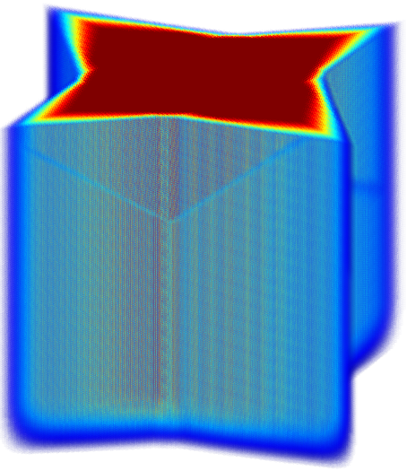

# BLEND

## Summary

Defines averaging kernels on the support of arbitrary space. 

One major application is the smooth merging of multidimensional datasets defined on regular grids.

Example figure above shows a volume rendering of blending weights from cosine taper functions defined on the support of an isotoxal star that is invariant in the z-axis.
