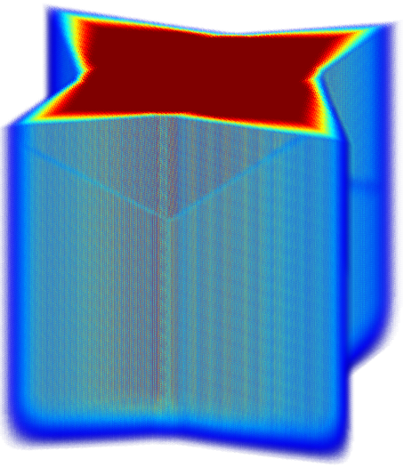

# BLEND

## Summary

Library for localizing functions using arbitrarily-shaped support on the regular Cartesian grid.
Applications include complex filter designs and merging of multidimensional datasets.



Figure: Volume rendering of a 3D cosine taper with an isotoxal star support that is invariant in the z-axis.

## Building and installation

### Build dependencies

To build BLEND, install:

- CMake 3.15 or newer
- A C compiler
- Ninja, optional but recommended for faster builds

### Configuring

BLEND uses CMake. The build is controlled by configuration files in the
`cmake` directory:

- `ConfigDefault.cmake` is version controlled and sets defaults for everyone.
  Do not edit this file.
- `ConfigUser.cmake` is not version controlled and overrides basic defaults
  for a local build.

Copy the user configuration template and edit the copy:

```sh
cp cmake/ConfigUserTemplate.cmake cmake/ConfigUser.cmake
```

For example, set the installation prefix in `cmake/ConfigUser.cmake`:

```cmake
set (CMAKE_INSTALL_PREFIX "/usr/local/opt/blend")
```

See the comments in `cmake/ConfigUserTemplate.cmake` for additional settings,
including install directories, static/shared library selection, and tests.

After making configuration choices, create a build directory and invoke CMake
from there:

```sh
mkdir build
cd build
cmake ..
```

To use Ninja:

```sh
mkdir build
cd build
cmake .. -G Ninja
```

### Building

In the build directory, type:

```sh
cmake --build .
```

This builds the BLEND static library, shared library, and optional test
executables when enabled in `cmake/ConfigUser.cmake`.

### Installing

In the build directory, type:

```sh
cmake --build . --target install
```

This installs the BLEND libraries, public header, and CMake package files to the
location set by `CMAKE_INSTALL_PREFIX` in `cmake/ConfigUser.cmake`. Depending on
the installation location, you may need write permission for this step.

### Uninstalling

The install step also installs a helper script:

```sh
share/tools/blend_uninstall.sh
```

Run it from the installation prefix to remove BLEND files:

```sh
share/tools/blend_uninstall.sh
```

Preview removals first with:

```sh
share/tools/blend_uninstall.sh --dry-run
```

### Running tests

To build tests, set this in `cmake/ConfigUser.cmake`:

```cmake
set (BLEND_BUILD_TESTS ON)
```

Then rebuild and run tests from the build directory:

```sh
cmake --build .
ctest
```

### Using an installed BLEND

Installed CMake projects can import BLEND with:

```cmake
find_package(blend CONFIG REQUIRED)
target_link_libraries(my_target PRIVATE BLEND::blend)
```

Use the installed public header as:

```c
#include <blend/blend.h>
```

## License

BLEND is licensed under the GNU Lesser General Public License, version 3
or any later version. See `LICENSE.TXT`, `COPYING.LESSER`, and `COPYING`
for details.

## Citation

If you use BLEND in published work, please cite the relevant reference:

1. Ajala, R., & Persaud, P. (2021).
   [Effect of merging multiscale models on seismic wavefield predictions near
   the southern San Andreas fault](https://scholar.google.com/scholar?q=Effect+of+merging+multiscale+models+on+seismic+wavefield+predictions+near+the+southern+San+Andreas+fault).
   `Journal of Geophysical Research: Solid Earth`, 126, 1-23.

2. Ajala, R., & Persaud, P. (2022).
   [Ground-motion evaluation of hybrid seismic velocity models](https://scholar.google.com/scholar?q=Ground-motion+evaluation+of+hybrid+seismic+velocity+models).
   `The Seismic Record`, 2, 186-196.

3. Ajala, R., Kolawole, F., Share, P. E., Sahakian, V., Delph, J. R.,
   Hooft, E., & He, B. (2025).
   [Toward an accessible framework for synthesizing solid earth models across
   multiple scales](https://scholar.google.com/scholar?q=Toward+an+accessible+framework+for+synthesizing+solid+earth+models+across+multiple+scales).
   In `Seismological Society of America Annual Meeting`, Baltimore, Maryland,
   USA, vol. 96, p. 1364.
