# BLEND

## Summary

Library for localizing functions using arbitrarily shaped support on the regular Cartesian grid. Applications include filter design and the synthesis (or merging) of multidimensional datasets (e.g., Ajala & Persaud, [2021](https://scholar.google.com/scholar?q=Effect+of+merging+multiscale+models+on+seismic+wavefield+predictions+near+the+southern+San+Andreas+fault), [2022](https://scholar.google.com/scholar?q=Ground-motion+evaluation+of+hybrid+seismic+velocity+models), and Ajala et al. [2025](https://www.researchgate.net/publication/392232576_Toward_an_Accessible_Framework_for_Synthesizing_Solid_Earth_Models_Across_Multiple_Scales)).

## Building and installation

### Build dependencies

To build BLEND, install:

- CMake 3.15 or newer
- A C compiler
- Ninja, optional but recommended for faster builds

### Configuring

BLEND uses CMake. The build is controlled by configuration files in the
`cmake` directory:

- `ConfigDefault.cmake` is version controlled and sets defaults for everyone.
  Do not edit this file.
- `ConfigUser.cmake` is not version controlled and overrides basic defaults
  for a local build.

Copy the user configuration template and edit the copy:

```sh
cp cmake/ConfigUserTemplate.cmake cmake/ConfigUser.cmake
```

For example, set the installation prefix in `cmake/ConfigUser.cmake`:

```cmake
set (CMAKE_INSTALL_PREFIX "/usr/local/opt/blend")
```

See the comments in `cmake/ConfigUserTemplate.cmake` for additional settings,
including install directories, static/shared library selection, tests, and
examples.

To build examples, enable examples in `cmake/ConfigUser.cmake`:

```cmake
set (BLEND_BUILD_EXAMPLES ON)
```

To build and run tests during installation, enable tests in
`cmake/ConfigUser.cmake`:

```cmake
set (BLEND_BUILD_TESTS ON)
```

After making configuration choices, create a build directory and invoke CMake
from there:

```sh
mkdir build
cd build
cmake ..
```

To use Ninja:

```sh
mkdir build
cd build
cmake .. -G Ninja
```

### Building

In the build directory, type:

```sh
cmake --build .
```

This builds the BLEND static library, shared library, and optional test
executables when enabled in `cmake/ConfigUser.cmake`.

### Running tests

If `BLEND_BUILD_TESTS` is `ON` in `cmake/ConfigUser.cmake`, run tests from the
build directory after `cmake --build .` has completed:

```sh
ctest
```

If `BLEND_BUILD_TESTS` was turned on after the build directory already existed,
rerun `cmake ..` and `cmake --build .` before running `ctest`.

### Installing

In the build directory, type:

```sh
cmake --build . --target install
```

This installs the BLEND libraries, public header, and CMake package files to the
location set by `CMAKE_INSTALL_PREFIX` in `cmake/ConfigUser.cmake`. Depending on
the installation location, you may need write permission for this step.

After installation, make sure the installation `bin` directory is in your
shell search path. If `CMAKE_INSTALL_PREFIX` is set to `/path/to/blend/install`,
add this to your shell startup file:

```sh
export PATH="/path/to/blend/install/bin:$PATH"
```

Then open a new terminal, or reload the startup file, and check the command:

```sh
blend --version
```

### Updating an existing installation

If BLEND was already installed and you want to update to the latest version
from Git, pull the latest changes, update the build directory, rebuild, and
install again:

```sh
cd /path/to/blend
git pull
cd build
cmake ..
cmake --build .
cmake --build . --target install
```

If you use a local `cmake/ConfigUser.cmake`, keep it in place so the updated
installation uses the same install prefix and options as before. Depending on
the installation location, you may need write permission for the install step.

To update and run the test suite before installing, first enable tests in
`cmake/ConfigUser.cmake`:

```cmake
set (BLEND_BUILD_TESTS ON)
```

Then rebuild and run `ctest`:

```sh
cd /path/to/blend
git pull
cd build
cmake ..
cmake --build .
ctest
cmake --build . --target install
```

### Uninstalling

The install step also installs a helper script:

```sh
./share/tools/blend_uninstall.sh
```

Run it from the installation prefix to remove BLEND files:

```sh
./share/tools/blend_uninstall.sh
```

Preview removals first with:

```sh
./share/tools/blend_uninstall.sh --dry-run
```

### Examples

Examples are in `doc/examples`. Each example has its own directory, following
the `ex01`, `ex02`, ... naming style. See `doc/examples/README.md` for
instructions that apply to all examples.

To build examples, set this in `cmake/ConfigUser.cmake`:

```cmake
set (BLEND_BUILD_EXAMPLES ON)
```

Then rebuild:

```sh
cmake --build .
```

Current examples:

- `doc/examples/ex01`: writes a symmetric cosine taper window of length
  `n = 100` to `ex01.txt`.
- `doc/examples/ex02`: writes a symmetric trapezoid taper window of length
  `n = 100` to `ex02.txt`.
- `doc/examples/ex03`: writes a 2D cosine taper over a triangular support on
  a 100 by 100 grid to `ex03.txt`.
- `doc/examples/ex04`: writes a 2D cosine taper over a square support on a
  100 by 100 grid to `ex04.txt`.
- `doc/examples/ex05`: writes a 2D cosine taper over a pentagon support on a
  100 by 100 grid to `ex05.txt`.
- `doc/examples/ex06`: writes a 2D cosine taper over a hexagon support on a
  100 by 100 grid to `ex06.txt`.
- `doc/examples/ex07`: writes a 2D cosine taper over a heptagon support on a
  100 by 100 grid to `ex07.txt`.
- `doc/examples/ex08`: writes a 2D cosine taper over an octagon support on a
  100 by 100 grid to `ex08.txt`.
- `doc/examples/ex09`: writes a 2D cosine taper over a nonagon support on a
  100 by 100 grid to `ex09.txt`.
- `doc/examples/ex10`: writes a 2D cosine taper over a decagon support on a
  100 by 100 grid to `ex10.txt`.
- `doc/examples/ex11`: writes a 2D cosine taper over a 4-pointed
  isotoxal-star support on a 100 by 100 grid to `ex11.txt`.
- `doc/examples/ex12`: writes a 3D cosine taper over the same 4-pointed
  isotoxal-star support as ex11 on a 100 by 100 by 25 grid to `ex12.txt`.
- `doc/examples/ex13`: checks a simplified South America polygon with
  `blend monotone` and writes an xy-monotone envelope to `ex13_monotone.txt`.

Example output gallery:

| ex01 | ex02 | ex03 |
| --- | --- | --- |
|  | 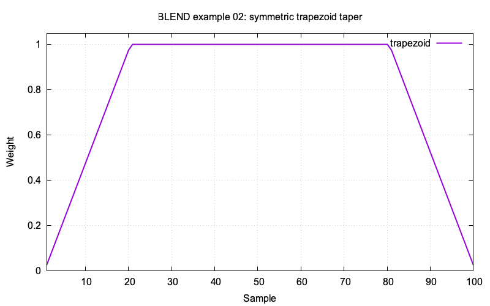 | 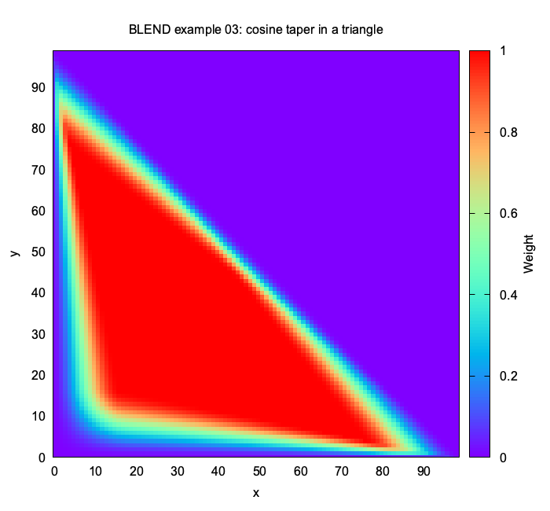 |

| ex04 | ex05 | ex06 |
| --- | --- | --- |
| 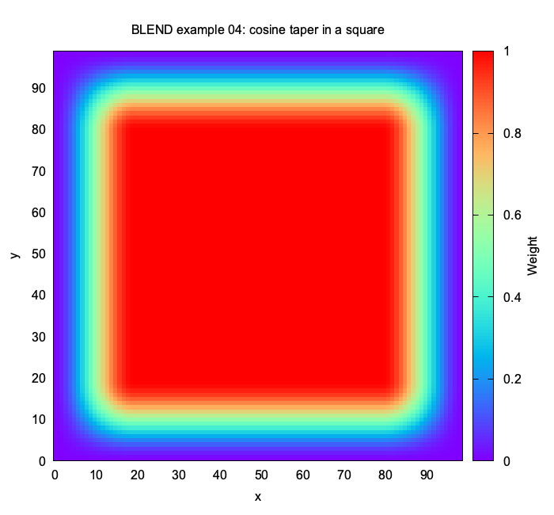 | 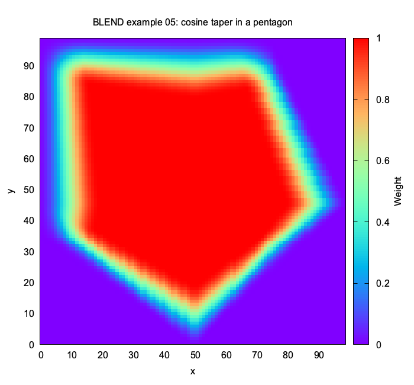 | 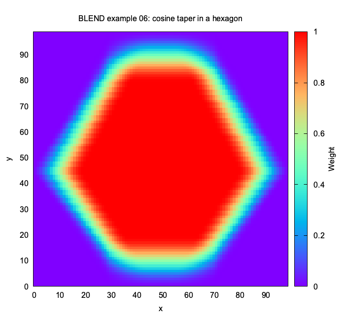 |

| ex07 | ex08 | ex09 |
| --- | --- | --- |
| 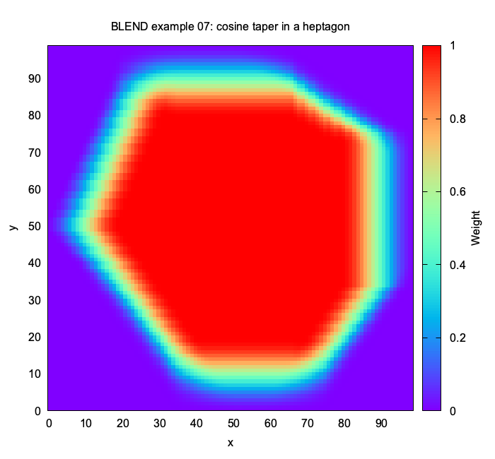 | 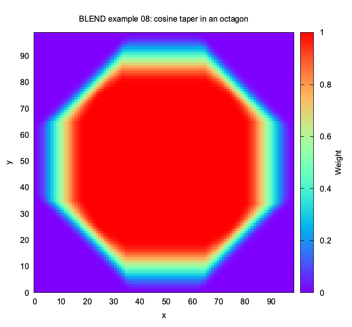 | 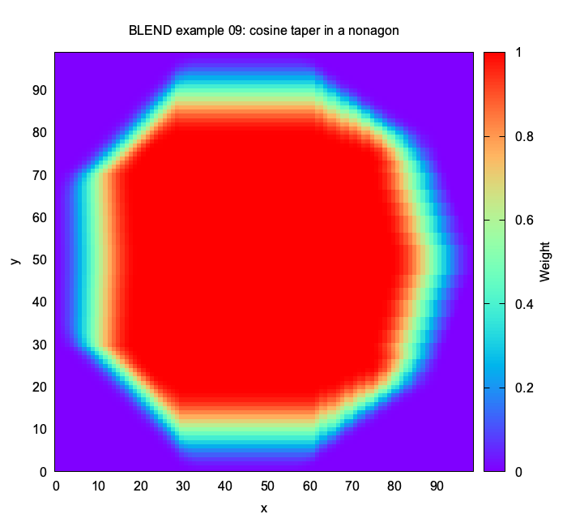 |

| ex10 | ex11 | ex12 |
| --- | --- | --- |
| 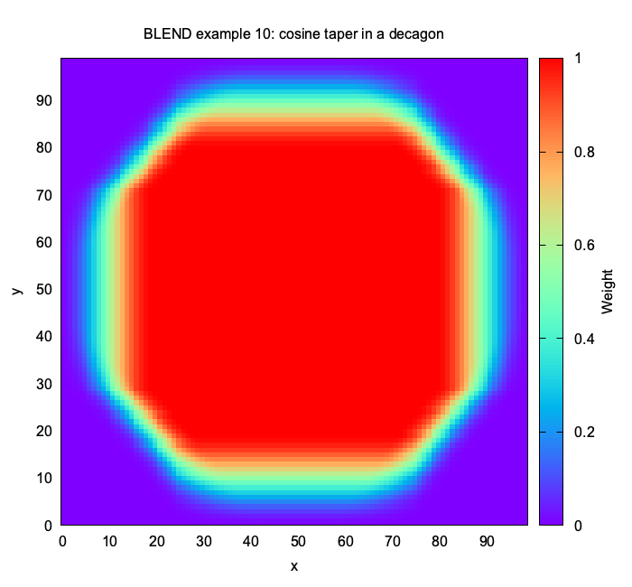 | 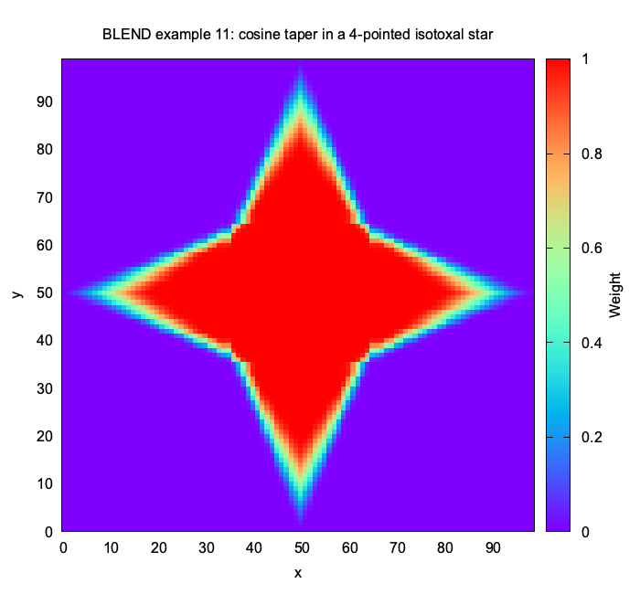 | 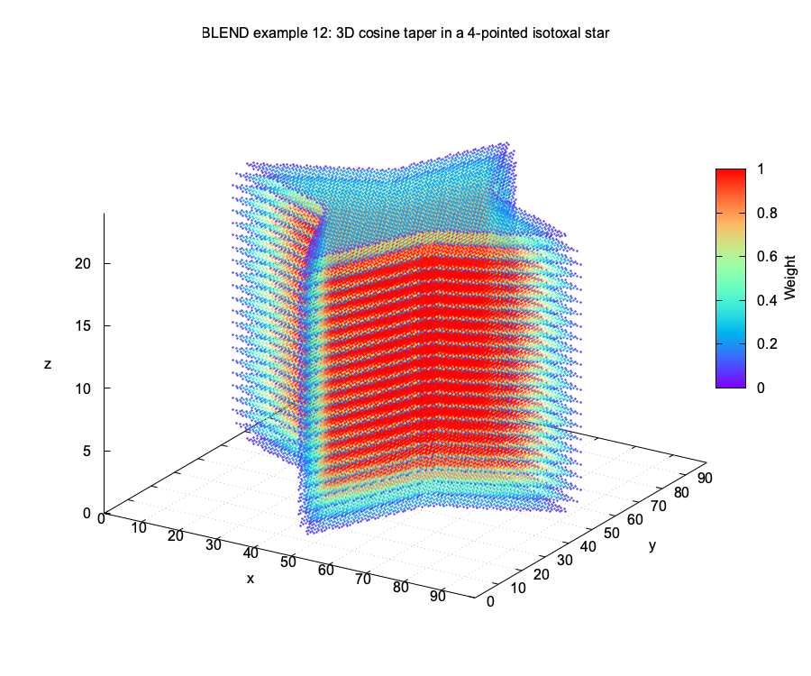 |

| ex13 |
| --- |
| 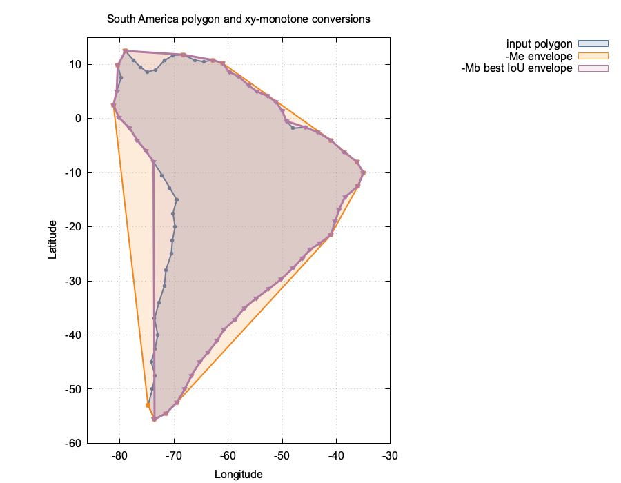 |

### Using an installed BLEND

Installed CMake projects can import BLEND with:

```cmake
find_package(blend CONFIG REQUIRED)
target_link_libraries(my_target PRIVATE BLEND::blend)
```

Use the installed public header as:

```c
#include <blend/blend.h>
```

## License

BLEND is licensed under the GNU Lesser General Public License, version 3
or any later version. See `LICENSE.TXT`, `COPYING.LESSER`, and `COPYING`
for details.

## Citation

If you use BLEND in published work, please cite the relevant references:

1. Ajala, R., & Persaud, P. (2021).
   [Effect of merging multiscale models on seismic wavefield predictions near
   the southern San Andreas fault](https://scholar.google.com/scholar?q=Effect+of+merging+multiscale+models+on+seismic+wavefield+predictions+near+the+southern+San+Andreas+fault).
   `Journal of Geophysical Research: Solid Earth`, 126, 1-23.

2. Ajala, R., & Persaud, P. (2022).
   [Ground-motion evaluation of hybrid seismic velocity models](https://scholar.google.com/scholar?q=Ground-motion+evaluation+of+hybrid+seismic+velocity+models).
   `The Seismic Record`, 2, 186-196.

3. Ajala, R., Kolawole, F., Share, P. E., Sahakian, V., Delph, J. R.,
   Hooft, E., & He, B. (2025).
   [Toward an accessible framework for synthesizing solid earth models across
   multiple scales](https://www.researchgate.net/publication/392232576_Toward_an_Accessible_Framework_for_Synthesizing_Solid_Earth_Models_Across_Multiple_Scales).
   In `Seismological Society of America Annual Meeting`, Baltimore, Maryland,
   USA, vol. 96, p. 1364.
