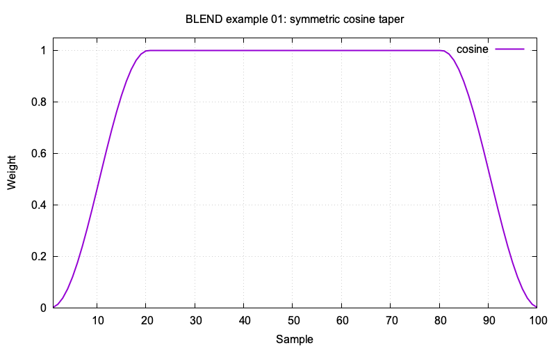
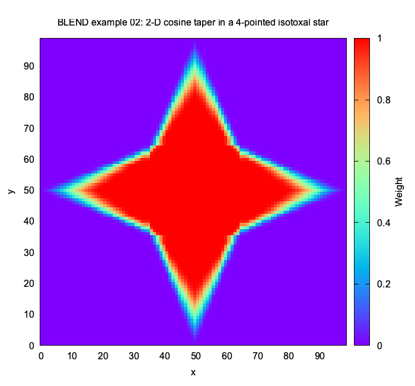
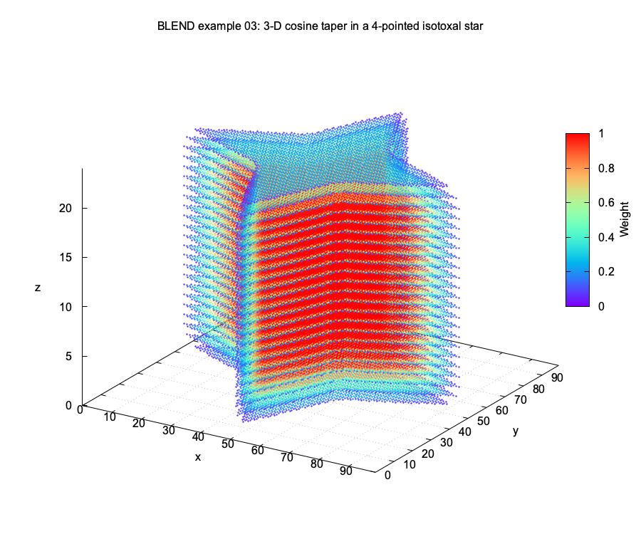
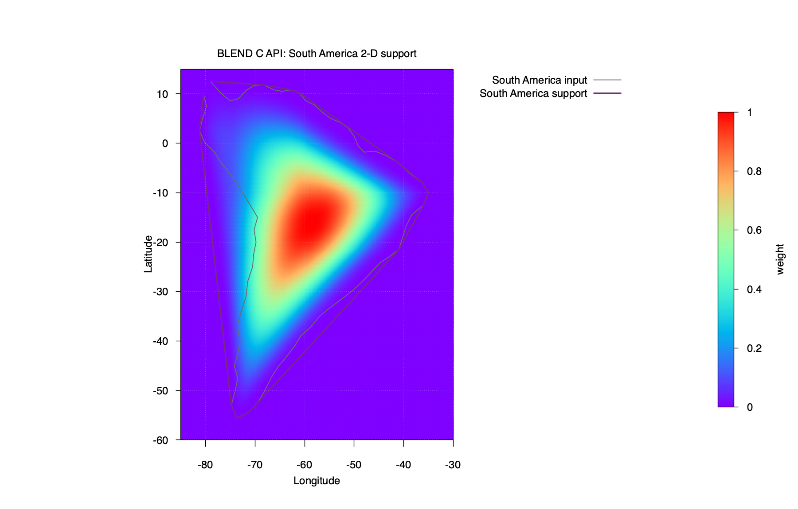

C API
=====

The public API is split into focused headers. ``blend.h`` remains the umbrella
header for users who want all public declarations.

.. toctree::
   :maxdepth: 1

   polygon
   window
   boundary
   contribution
   utils
   reporting

API Examples
------------

These C API examples show direct use of the public API, from a single 1-D
window taper to 2-D and 3-D polygon-supported embeddings.

ex01_api
~~~~~~~~

``ex01_api`` evaluates a symmetric 1-D cosine taper.

.. literalinclude:: ../../../examples/ex01_api/ex01_api.c
   :language: c

ex02_api
~~~~~~~~

``ex02_api`` evaluates a 2-D cosine taper inside a 4-pointed isotoxal-star
support polygon.

.. literalinclude:: ../../../examples/ex02_api/ex02_api.c
   :language: c

ex03_api
~~~~~~~~

``ex03_api`` extends the same polygon-supported taper into 3-D.

.. literalinclude:: ../../../examples/ex03_api/ex03_api.c
   :language: c

ex04_api
~~~~~~~~

``ex04_api`` reads the South America polygon used by ``ex03_window2d``,
checks whether the grid-snapped polygon is strictly xy-monotone, converts it
with the strict xy-monotone envelope method used by ``-ME``, and then builds a
2-D cosine window from the converted support.

.. literalinclude:: ../../../examples/ex04_api/ex04_api.c
   :language: c

