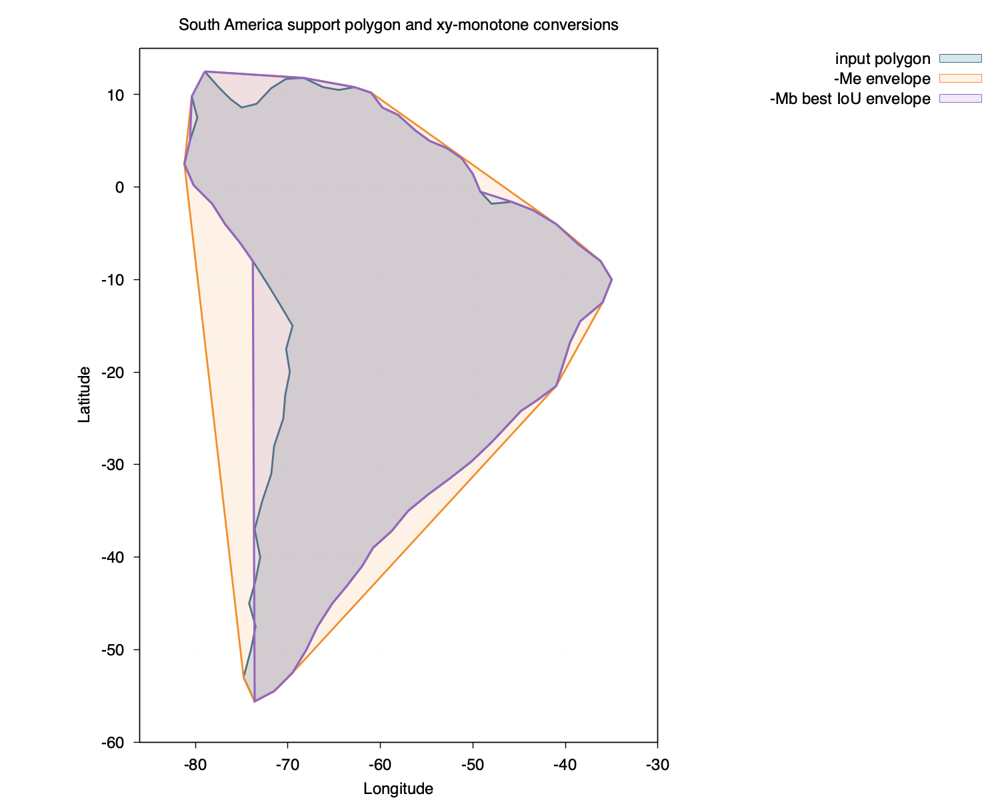
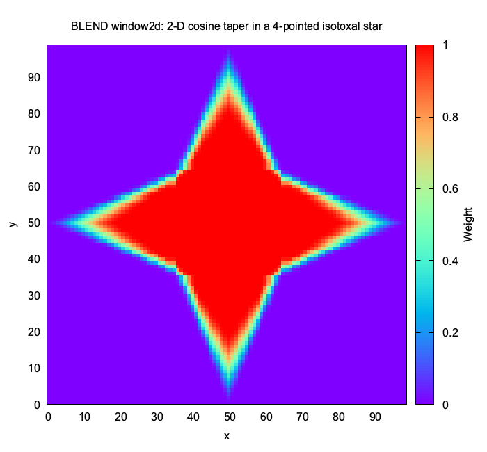
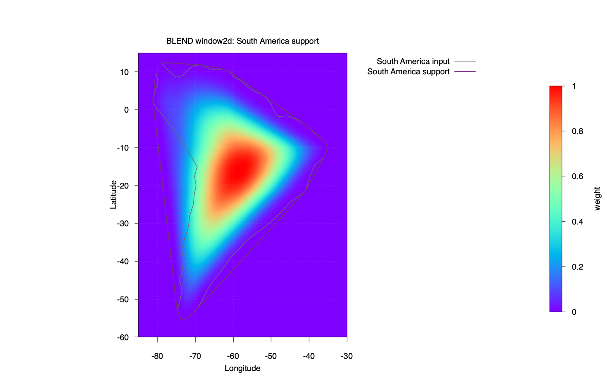
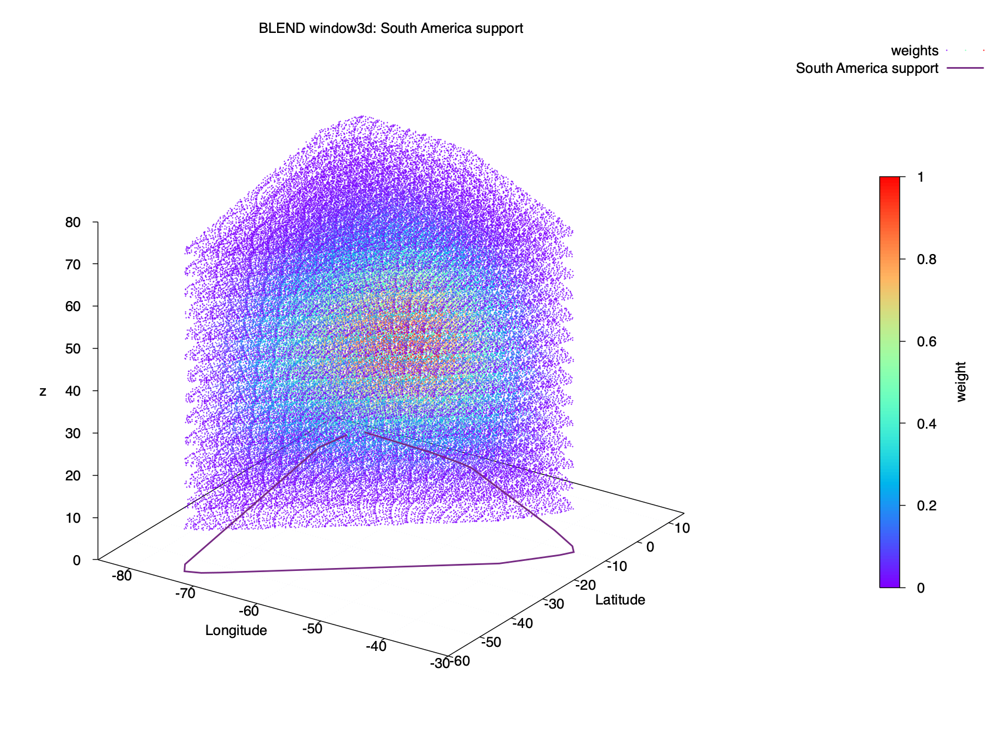
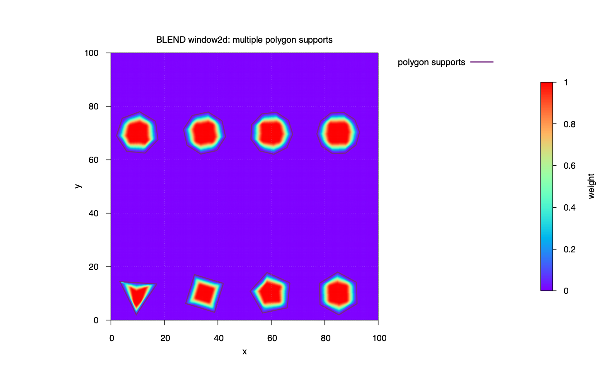

Examples
========

The examples are stored in ``doc/examples``. See the ``doc/examples/README.md`` file for more instructions.
``gnuplot`` is used to generate the plots in the examples. If gnuplot is not installed, you can still run 
the examples and use a different plotting tool of your choosing to visualize the results.

ex01_monotone
-------------

``ex01_monotone`` In this example, we download a crude outline of South America and convert it to a monotone 
polygon using the envelope ``-Me`` and piecewise-envelope ``-Mb`` option of the ``monotone`` module. 
The resulting monotone polygons are written and compared to the original in the plot.

.. literalinclude:: ../../../examples/ex01_monotone/ex01_monotone.sh
   :language: sh

ex02_window2d
-------------

``ex02_window2d`` In this example, we localize a 2-D cosine window in an isotoxal star using the ``window2d`` 
command-line module.

.. literalinclude:: ../../../examples/ex02_window2d/ex02_window2d.sh
   :language: sh

Below are the contents of the isotoxal star blendfile (i.e., ``isotoxal_star.blend``) used in this example:

.. literalinclude:: ../../../examples/ex02_window2d/isotoxal_star.blend
   :language: text

ex03_window2d
-------------

``ex03_window2d`` In this example, we localize a 2-D cosine window function over South America.
We first make the polygon monotone using the strict-envelope ``-ME`` option, and write the modified polygon by 
supplying the ``-N`` option. The plot shows the results of the original polygon, the modified polygon, and the 
localized window function. The ``-MB`` option gives  a more refined polygon that is closer to the original, 
as we see in ``ex01_monotone``, but the shape includes an overhang that can make the function localization 
awkward. So, ``-MB`` is still experimental for localization.

.. literalinclude:: ../../../examples/ex03_window2d/ex03_window2d.sh
   :language: sh

Below are the contents of the South America blendfile (i.e., ``south_america.blend``) used in this example:

.. literalinclude:: ../../../examples/ex03_window2d/south_america.blend
   :language: text

ex04_window3d
-------------

``ex04_window3d`` uses the same xy support as ``ex03_window2d`` and adds a
vertical dimension and taper for South America.

.. literalinclude:: ../../../examples/ex04_window3d/ex04_window3d.sh
   :language: sh

Below are the contents of the South America blendfile (i.e., ``south_america.blend``) used in this example:

.. literalinclude:: ../../../examples/ex04_window3d/south_america.blend
   :language: text

ex05_window2d
-------------

``ex05_window2d`` This example shows how to define multiple supports in a domain. 
Here, we define eight different supports in one blendfile. The supports are regular 
polygons from a triangle through a decagon, arranged in two rows within ``-R0/100/0/100``. 
Every support uses cosine tapers with symmetric taper ratios of ``0.3``.

.. literalinclude:: ../../../examples/ex05_window2d/ex05_window2d.sh
   :language: sh

Below are the contents of the blendfile (i.e., ``polygons.blend``) used in this example:

.. literalinclude:: ../../../examples/ex05_window2d/polygons.blend
   :language: text

