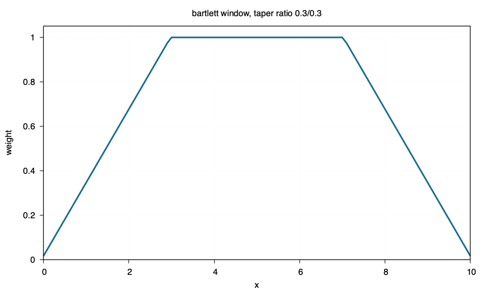

bartlett
========

Command
-------

.. code-block:: sh

   blend window1d -R0/10 -I0.1 -Fbartlett -T0.3/0.3 > bartlett.txt

Figure
------

Source
------

.. literalinclude:: ../../../../examples/bartlett/bartlett.sh
   :language: sh
