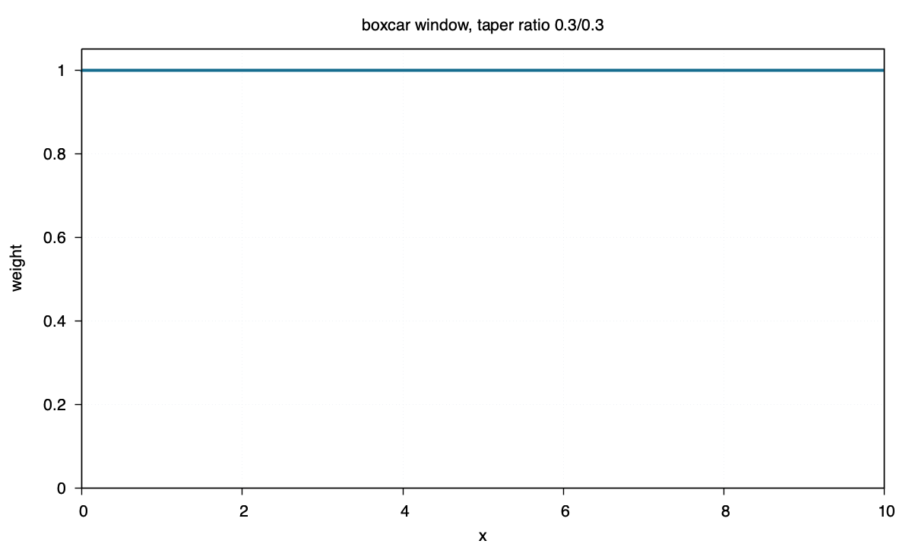

boxcar
======

Command
-------

.. code-block:: sh

   blend window1d -R0/10 -I0.1 -Fboxcar -T0.3/0.3 > boxcar.txt

Figure
------

Source
------

.. literalinclude:: ../../../../examples/boxcar/boxcar.sh
   :language: sh
