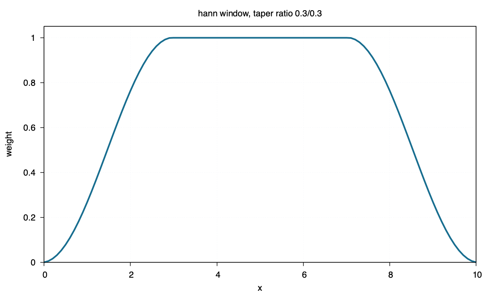

hann
====

Command
-------

.. code-block:: sh

   blend window1d -R0/10 -I0.1 -Fhann -T0.3/0.3 > hann.txt

Figure
------

Source
------

.. literalinclude:: ../../../../examples/hann/hann.sh
   :language: sh
