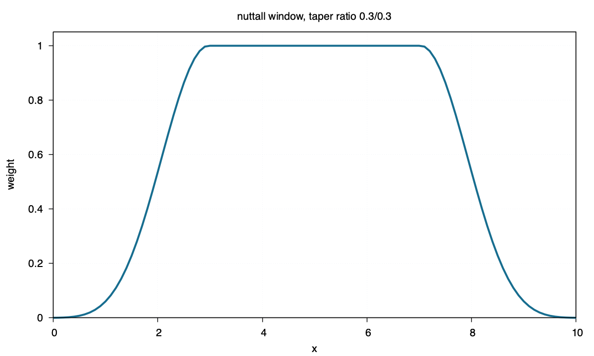

nuttall
=======

Command
-------

.. code-block:: sh

   blend window1d -R0/10 -I0.1 -Fnuttall -T0.3/0.3 > nuttall.txt

Figure
------

Source
------

.. literalinclude:: ../../../../examples/nuttall/nuttall.sh
   :language: sh
