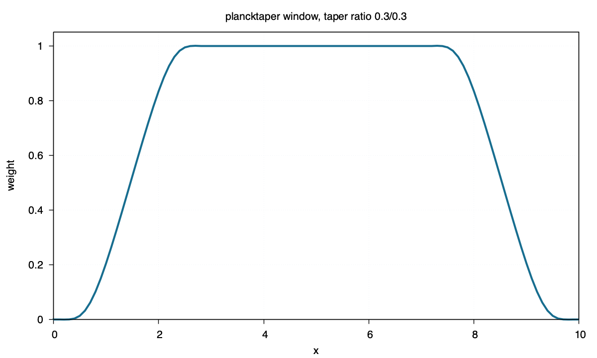

plancktaper
===========

Command
-------

.. code-block:: sh

   blend window1d -R0/10 -I0.1 -Fplancktaper -T0.3/0.3 > plancktaper.txt

Figure
------

Source
------

.. literalinclude:: ../../../../examples/plancktaper/plancktaper.sh
   :language: sh
