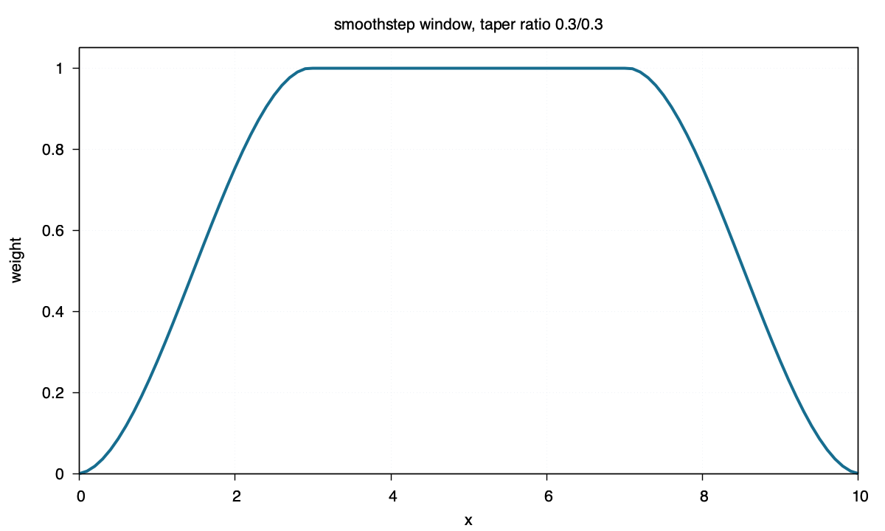

smoothstep
==========

Command
-------

.. code-block:: sh

   blend window1d -R0/10 -I0.1 -Fsmoothstep -T0.3/0.3 > smoothstep.txt

Figure
------

Source
------

.. literalinclude:: ../../../../examples/smoothstep/smoothstep.sh
   :language: sh
