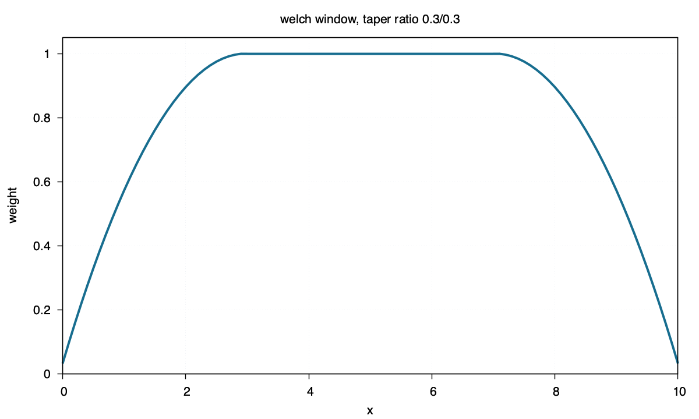

welch
=====

Command
-------

.. code-block:: sh

   blend window1d -R0/10 -I0.1 -Fwelch -T0.3/0.3 > welch.txt

Figure
------

Source
------

.. literalinclude:: ../../../../examples/welch/welch.sh
   :language: sh
